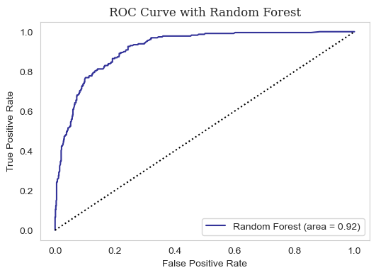

### Project Result

#### 김한성

```text
Confusion Matrix 
 [[385  78]
 [183 360]]
Accuracy score: 74.055666%
Precision score: 82.191781%
Recall score: 66.298343%
F1 score: 73.394495%
ROC-AUC score: 74.725845%
```

#### 김찬영

```text
              precision    recall  f1-score   support

           0       0.71      0.66      0.68       450
           1       0.74      0.78      0.76       567

    accuracy                           0.73      1017
   macro avg       0.72      0.72      0.72      1017
weighted avg       0.73      0.73      0.73      1017
```


#### 이문기

```text
              precision    recall  f1-score   support

           0       0.91      0.92      0.91       788
           1       0.71      0.69      0.70       229

    accuracy                           0.87      1017
   macro avg       0.81      0.80      0.81      1017
weighted avg       0.87      0.87      0.87      1017
```

